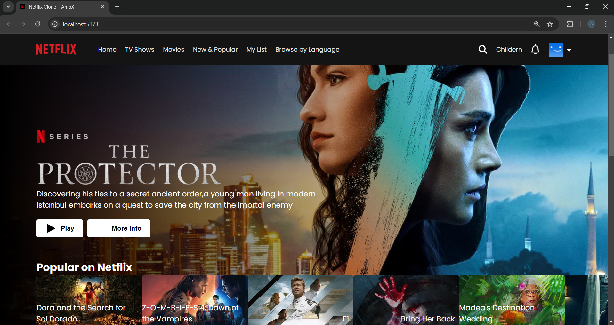
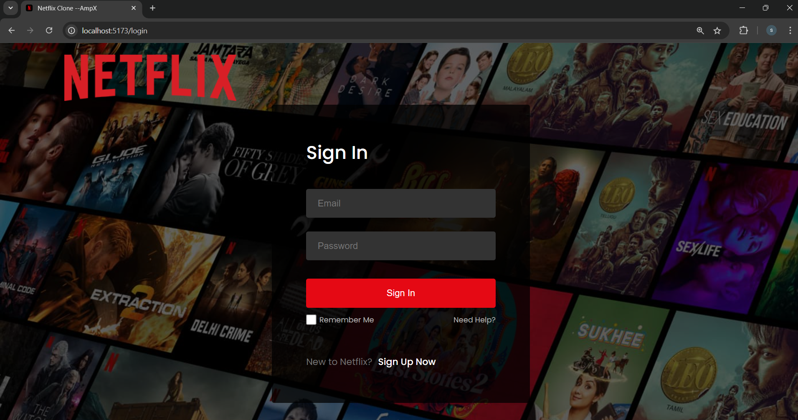
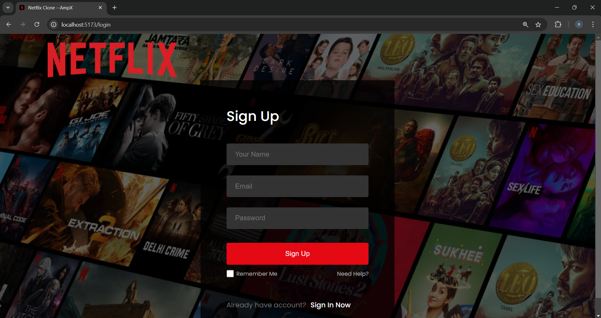

# Netflix Clone 🎬 (React)

A clean and responsive Netflix clone built using **React.js**. This project replicates the Netflix homepage UI, showcasing reusable components, dynamic routing, hover interactions, and mock content cards.


## 📸 Preview






## 🚀 Features

- React functional components & hooks
- Dynamic movie row components
- Hover-based card effects
- Fully responsive layout (mobile-friendly)
- Scrollable carousels
- Styled using plain CSS or CSS Modules

---

## 🧠 Technologies Used

- **React.js**
- **React Router**
- **HTML5 + CSS3**
- **JavaScript (ES6+)**
-  Axios, TMDB API (for real data)

---


---

## 🛠️ Installation & Setup

1. Clone the repo:

```git clone https://github.com/Shweta4499/Netflix-clone.git```
```cd Netflix-clone```
2.Install dependencies:
```npm install```
3.Open in browser:
```http://localhost:5173```

🎯 Credits & Inspiration
Inspired by Netflix UI. This clone is built for educational and portfolio purposes only.

Made by @Shweta4499 ❤️


